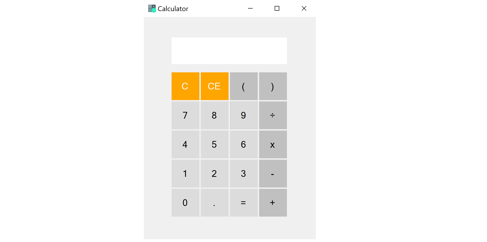

# calculator

## About 

This is the source code for a simple calculator app that was made to replicate modern calculator apps that can be seen on smartphones. It was created as a Visual Studio Windows Form Application and written in C#. 

Created with Visual Studio 2017.

## To Run

### Production 

* Run the MyNewCalculator.exe file.

### Development

* The source code can be opened by selecting **MyNewCalculator/MyNewCalculator.sln**, which should open if Visual Studio is installed. 
* Build the project.
* You can then select the **run** option, which looks like a green play button. 

 

